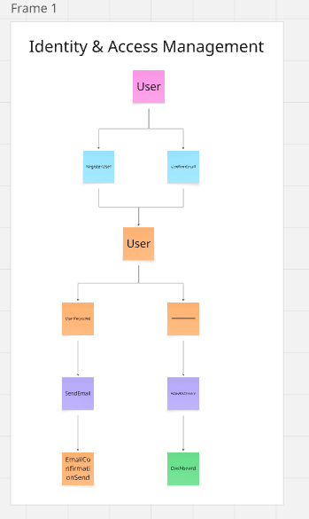

# Event Storming: Identity & Access Context

Ten moduł odpowiada za tożsamość użytkowników, procesy rejestracji, logowania oraz zarządzanie uprawnieniami.

## Bounded Context: Identity & Access

Zarządzanie kontami użytkowników, autentykacja (JWT, OAuth) i autoryzacja (Role).

## Zdarzenia Domenowe (Domain Events)

- UserRegistered
- EmailConfirmationSent
- EmailConfirmed
- UserLoggedIn
- UserLoggedOut
- FacebookOAuthCompleted
- PasswordResetRequested
- PasswordResetLinkSent
- PasswordChanged
- UserNameChanged
- UserEmailChanged
- UserDeleted

## Komendy (Commands)

- RegisterUser
- ConfirmEmail
- LoginUser
- LogoutUser
- LoginViaFacebook
- RegisterViaFacebook
- RequestPasswordReset
- SetNewPassword
- ChangeUserName
- ChangeUserEmail
- ChangePassword
- DeleteUser

## Agregat (Aggregate)

### User

- **ID:** UserId
- **Stan:** Email, PasswordHash, Name, Roles, IsActive, FacebookId, LockoutEnd.

## Polityki (Policies)

- **Jeśli UserRegistered** -> SendEmailConfirmation
- **Jeśli PasswordResetRequested** -> SendPasswordResetLink
- **Jeśli EmailConfirmed** -> ActivateUserAccount
- **Jeśli UserLockedOut** -> PreventLogin (polityka współdzielona z Moderacją)

## Widoki (Read Models)

- **UserProfileView:** Dane profilowe zalogowanego użytkownika (Imię, Email, Rola).

## Kluczowe Procesy Biznesowe

1. **Rejestracja:** Rejestracja -> Wysłanie maila -> Potwierdzenie linku -> Aktywacja konta.
2. **Social Login:** Autoryzacja przez Facebook -> Powiązanie z kontem lub nowa rejestracja.

## Pytania i Problemy

- Czy wspieramy MFA (Multi-Factor Authentication)?
- Jak długo ważny jest token resetu hasła?

## Podgląd

## Link do Miro

https://miro.com/app/board/uXjVGfGpkw0=/?share_link_id=89251186254
