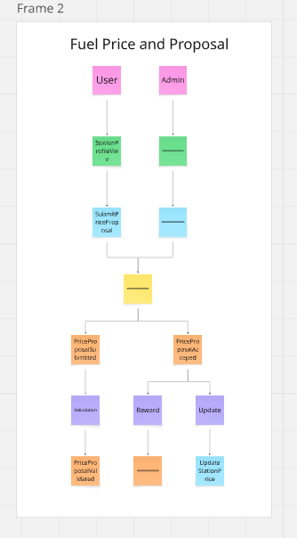

# Event Storming: Fuel Pricing Context

Ten moduł to serce aplikacji – odpowiada za system społecznościowego raportowania cen i ich weryfikację.

## Bounded Context: Fuel Pricing

Proces zgłaszania cen przez użytkowników, ich walidacja przez admina i system nagradzania punktami.

## Zdarzenia Domenowe (Domain Events)

- PriceProposalSubmitted
- PriceProposalValidated
- PriceProposalRejectedByValidation
- PhotoUploaded
- PriceProposalAccepted
- PriceProposalRejected
- PointsAwarded

## Komendy (Commands)

- SubmitPriceProposal
- UploadPhoto
- AcceptProposal (admin)
- RejectProposal (admin)
- ViewProposal (admin)

## Agregat (Aggregate)

### PriceProposal

- **ID:** ProposalId
- **Stan:** UserId, StationId, ProposedPrices, PhotoUrl, Status (Pending/Accepted/Rejected), AdminToken.

## Polityki (Policies)

- **Jeśli PriceProposalSubmitted** -> ValidateProposal (format danych, rozmiar zdjęcia).
- **Jeśli PriceProposalRejectedByValidation** -> NotifyUserAboutError.
- **Jeśli PriceProposalAccepted** -> AwardPoints (dodanie punktów do profilu użytkownika).
- **Jeśli PriceProposalAccepted** -> UpdateStationPrices (wyzwolenie zmiany w Station Management).

## Widoki (Read Models)

- **ProposalListView (Admin):** Lista oczekujących propozycji do weryfikacji.
- **UserProposalsHistoryView:** Historia zgłoszeń danego użytkownika i ich statusy.
- **TopUsersRankingView:** Ranking użytkowników na podstawie zdobytych punktów.

## Kluczowe Procesy Biznesowe

1. **Zgłaszanie ceny:** Wybór stacji -> Wpisanie cen -> Upload zdjęcia -> Walidacja techniczna.
2. **Moderacja propozycji:** Przegląd admina -> Akceptacja -> Aktualizacja cen na stacji + przyznanie punktów.

## Pytania i Problemy

- **Konflikt propozycji:** Co jeśli dwóch użytkowników zgłasza cenę dla tej samej stacji w odstępie 5 minut?
- **Spam:** Jak ograniczyć możliwość wysyłania fałszywych propozycji przez boty?

## Podgląd

## Link do Miro

https://miro.com/app/board/uXjVGfGpkw0=/?share_link_id=89251186254
