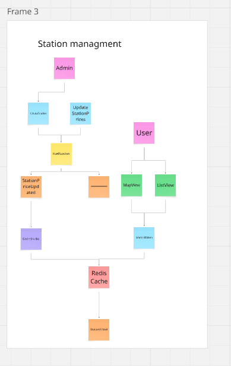

# Event Storming: Station Management Context

Moduł odpowiedzialny za bazę danych stacji, marek, typów paliw oraz ich wyświetlanie na mapie.

## Bounded Context: Station Management

Utrzymywanie danych o infrastrukturze stacji oraz szybkie wyszukiwanie stacji w okolicy.

## Zdarzenia Domenowe (Domain Events)

- StationCreated
- StationUpdated
- StationDeleted
- StationPricesUpdated
- StationViewed
- StationsFiltered
- StationsSorted
- NearestStationsRequested
- BrandCreated / BrandUpdated / BrandDeleted
- FuelTypeCreated / FuelTypeUpdated / FuelTypeDeleted

## Komendy (Commands)

- CreateStation (admin)
- UpdateStation (admin)
- DeleteStation (admin)
- ViewStationProfile
- SearchStations (filtry)
- GetNearestStations
- CreateBrand / CreateFuelType (admin)

## Agregaty (Aggregates)

### FuelStation

- **ID:** StationId
- **Stan:** BrandId, Address, Location (Geom), CurrentPrices (JSON/Relacja).

### Brand

- **Stan:** Name, LogoUrl.

### FuelType

- **Stan:** Code (PB95, ON), Name.

## Polityki (Policies)

- **Jeśli StationPricesUpdated** -> InvalidateStationCache (Redis).
- **Jeśli StationsFiltered** -> CheckCacheFirst.

## Widoki (Read Models)

- **StationMapView:** Punkty na mapie z podstawową ceną (zoptymalizowane pod GeoJSON).
- **StationListView:** Lista stacji z odległościami i cenami.
- **StationProfileView:** Pełne dane stacji, historia zmian cen, godziny otwarcia.

## Kluczowe Procesy Biznesowe

1. **Wyszukiwanie najtańszej stacji:** Określenie lokalizacji -> Wybór paliwa -> Sortowanie po cenie -> Prezentacja wyników.

## Pytania i Problemy

- **Dodawanie przez użytkowników:** Czy pozwolić użytkownikom sugerować nowe stacje?
- **Historia cen:** Jak długo trzymamy historię, by generować wykresy dla widoku profilu?
- **Logotypy:** Skąd brać aktualne logotypy marek?

## Podgląd

## Link do Miro

https://miro.com/app/board/uXjVGfGpkw0=/?share_link_id=89251186254
