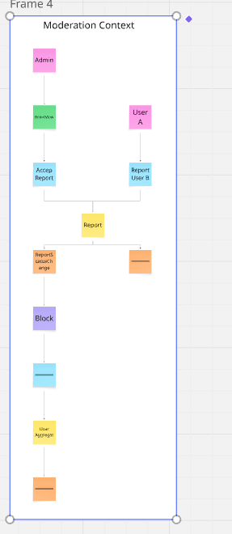

# Event Storming: Moderation Context

Moduł dbający o bezpieczeństwo społeczności i czystość danych poprzez system zgłoszeń.

## Bounded Context: Moderation

Zarządzanie zgłoszeniami nadużyć (toxic users) i ogólne statystyki systemu.

## Zdarzenia Domenowe (Domain Events)

- UserReported
- ReportStatusChanged
- UserLockedOut
- UserUnlocked
- UserRoleChanged
- StatisticsGenerated

## Komendy (Commands)

- ReportUser
- ChangeReportStatus (admin)
- LockOutUser (admin)
- UnlockUser (admin)
- ChangeUserRole (admin)
- ViewStatistics (admin)

## Agregat (Aggregate)

### Report

- **ID:** ReportId
- **Stan:** ReportingUserId, ReportedUserId, Reason, Status (Pending/Accepted/Rejected).

## Polityki (Policies)

- **Jeśli ReportStatusChanged (Status=Accepted)** -> LockOutReportedUser.
- **Jeśli UserLockedOut** -> Trigger Logout on all sessions.

## Widoki (Read Models)

- **ReportsView (Admin):** Tabela zgłoszeń wymagających interwencji.
- **UserManagementView (Admin):** Lista wszystkich użytkowników z możliwością edycji ról/blokad.
- **AdminDashboardView:** Wykresy przyrostu użytkowników i liczby propozycji cen.

## Kluczowe Procesy Biznesowe

1. **Blokowanie użytkownika:** Zgłoszenie przez innego członka społeczności -> Przegląd admina -> Blokada konta.

## Pytania i Problemy

- **Automatyczna blokada:** Czy po X zgłoszeniach system powinien sam blokować konto przed interwencją admina?
- **Ranking:** Czy zablokowany użytkownik powinien znikać z Rankingu (TopUsers)?

## Podgląd

## Link do Miro

https://miro.com/app/board/uXjVGfGpkw0=/?share_link_id=89251186254
